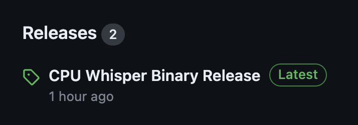

# Using Github Action to build Candle image on Azure Spot Runner VM

## Prerequisites
* A [Github Account](https://github.com/join)
* An [Azure Account](https://azure.microsoft.com/en-us/free)
* Finish setup [Azure Spot Runner](./azure-spot-runner.md)

## Create Github Secrets
1. In Github, go to your repository. 
2. Go to **Settings** in the navigation menu.
3. Select **Securigy > Secrets and variables > Actions**. 
4. Select **New Repository Secret**
5. Paste the entire [Json output](https://github.com/ScottLL/candle-cookbook/blob/e96d35af185ec67f382e1ac891590197705d7ffd/src/azure/hello-azure.md#L49-L50) from the Azure CLI command into the github action secret's value field. Give the secret the name: `AZURE_CREDENTIALS`. 
5. Select **Add secret.**

## Build your image

### Structure Overview

```
- Azure-spot-runner 
  - .github/workflow
    - create-image.yml
    - runner.yml
  - workflow-artifacts
    - cloud-init.txt
    - setup-image.sh
```

1. Use the Create-Image.yml file below to create a custom virtual machine image.

    ```
    on: workflow_dispatch

    jobs:
      job1:
        runs-on: ubuntu-latest
        name: Create Custom Linux Image
        steps:
        - name: Checkout
          uses: actions/checkout@v2

        - name: Login via Az module
          uses: azure/login@v1
          with:
            creds: ${{secrets.AZURE_CREDENTIALS}}

        - name: Build and Distribute Custom VM Image
          uses: azure/build-vm-image@v0
          with:
            resource-group-name: '<RESOURCE_GROUP_NAME>'
            location: '<RESOURCE_LOCATION>'
            managed-identity: '<AZURE-IDENTITY>' 
            source-os-type: 'linux'
            vm-size: "Standard_D2s_v3"
            source-image-type: 'platformimage'
            source-image: Canonical:0001-com-ubuntu-server-jammy:22_04-lts-gen2:latest
            customizer-source: ${{ github.workspace }}/workflow-artifacts
            customizer-script: |
              ls -l /tmp/
              ls -l /tmp/workflow-artifacts
              sh /tmp/workflow-artifacts/setup-image.sh


    ```

* You can modify the following information to your own secrets you build in [azure-spot-runner](./azure-spot-runner.md)


  ```
  resource-group-name: '<RESOURCE_GROUP_NAME>'
  location: '<RESOURCE_LOCATION>'
  managed-identity: '<AZURE-IDENTITY>'       
  ```
  Replace the placeholders, where you created them in the Hello-azure.md, 

  * [RESOURCE_GROUP_NAME](./azure-spot-runner.md#L27)
  * [RESOURCE_LOCATION](./hello-azure.md#L58)
  * [AZURE-IDENTITY](./hello-azure.md#L73)

  You can also change the VM type (CPU & GPU) by changing `<vm-size>`, `<source-image-type>`, `<source-image>`


2. You will also create an `setup-image.sh` below for the image build. 

    ```
    #!/bin/bash
    #
    # Setup the runner to have the Azure CLI pre-installed as well as the Actions
    # Runner

    # Define a working directory
    WORK_DIR="/opt/actions-runner"

    # Install Azure CLI, should not use sudo
    curl -sL https://aka.ms/InstallAzureCLIDeb | bash

    # Create a folder
    mkdir -p $WORK_DIR && cd $WORK_DIR

    # Download the latest runner package
    curl -O -L https://github.com/actions/runner/releases/download/v2.310.2/actions-runner-linux-x64-2.310.2.tar.gz

    # Extract the installer
    tar xzf $WORK_DIR/actions-runner-linux-x64-2.310.2.tar.gz

    ```

## Start your Runner and Build the Binary
1. After you create the VM image, now we can start run it by using the Runner.yml below:

    ```
    on: workflow_dispatch

    jobs:
      job1:
        runs-on: ubuntu-latest
        name: Launch Runner
        steps:
        - name: Checkout
          uses: actions/checkout@v2

        - name: Get GitHub Runner Registration Token
          run: |
            set -e
            RUNNER_TOKEN=$(curl -f -X POST \
                            -H "Authorization: token ${{ secrets.PAT }}" \
                            -H "Accept: application/vnd.github.v3+json" \
                            https://api.github.com/repos/<YOUR_REPO_LOCATION>/actions/runners/registration-token | grep token | cut -d '"' -f 4)
            echo $RUNNER_TOKEN
            if [ -z "$RUNNER_TOKEN" ]; then
              echo "Failed to retrieve the runner token."
              exit 1
            fi
            echo "RUNNER_TOKEN=$RUNNER_TOKEN" >> $GITHUB_ENV
          env:
            PAT: ${{ secrets.PAT }}

        - name: Modify cloud-init.txt
          run: |
            set -e
            sed -i "2iRUNNER_TOKEN=$RUNNER_TOKEN" workflow-artifacts/cloud-init.txt
            if ! grep -q "RUNNER_TOKEN=$RUNNER_TOKEN" workflow-artifacts/cloud-init.txt; then
              echo "Modification with sed failed."
              exit 1
            fi

        - name: Login via Az module
          uses: azure/login@v1
          with:
            creds: ${{secrets.AZURE_CREDENTIALS}}

        - name: Find the latest image URI
          id: find_image
          uses: azure/CLI@v1
          with:
            inlineScript: |
              IMAGE_URI=$(az image list --resource-group githubVM --query "[-1].id" --output tsv)
              echo "::set-output name=image_uri::$IMAGE_URI"


        - name: CREATE VM
          id: create_vm
          uses: azure/CLI@v1
          with:
            inlineScript: |
              az vm create --resource-group githubVM  --name "app-vm-${{ GITHUB.RUN_NUMBER }}"  --admin-username "runner" --admin-password "${{ secrets.VM_PASSWORD }}" --location  eastus \
              --custom-data workflow-artifacts/cloud-init.txt \
              --image "${{ steps.find_image.outputs.image_uri }}" \
              --generate-ssh-keys

        # At the end of your CREATE VM step
        - name: Set VM Name Output
          run: echo "::set-output name=vm_name::app-vm-${{ GITHUB.RUN_NUMBER }}"
          id: vm_name
    ```

2. You can add your customer code inside the `workflow-artifacts/cloud-init.txt` below for specific need.

    ```
    #!/bin/bash

    # Define a working directory
    export HOME=/root
    WORK_DIR="/opt/actions-runner"

    # Start the runner
    chown -R runner $WORK_DIR
    su - runner -c "$WORK_DIR/config.sh --unattended --url https://github.com/nogibjj/candle_scott_Azure_vm --token $RUNNER_TOKEN"
    nohup su - runner -c "$WORK_DIR/run.sh" &

    # Install packages
    apt-get update
    apt-get install -y build-essential pkg-config libssl-dev protobuf-compiler jq git-lfs curl jq
    git lfs install

    # Install Rust
    curl --proto '=https' --tlsv1.2 -sSf https://sh.rustup.rs | sh -s -- -y
    export PATH="$HOME/.cargo/bin:$PATH"

    # Get the candle Repo
    git clone https://github.com/huggingface/candle.git /root/candle
    cd /root/candle


    # Build the model and depoly the binary into Github Release. 
    if cargo build --example whisper --release; then
        FILE="/root/candle/target/release/examples/whisper"
        MIME_TYPE=$(file -b --mime-type "$FILE")
        TAG="v$(date +%Y%m%d%H%M%S)"
        RELEASE_NAME="CPU Whisper Binary Release"
        GITHUB_TOKEN="$GITHUB_TOKEN"  # Token passed from GitHub Actions

        CREATE_RELEASE_RESPONSE=$(curl -X POST -H "Authorization: token $GITHUB_TOKEN" -H "Content-Type: application/json" -d "{\"tag_name\": \"$TAG\", \"name\": \"$RELEASE_NAME\"}" "https://api.github.com/repos/nogibjj/candle_scott_Azure_vm/releases")
        UPLOAD_URL=$(echo $CREATE_RELEASE_RESPONSE | jq -r .upload_url | sed "s/{?name,label}//")

        curl -X POST -H "Authorization: token $GITHUB_TOKEN" -H "Content-Type: $MIME_TYPE" --data-binary @"$FILE" "$UPLOAD_URL?name=$(basename "$FILE")"
    else
        echo "Cargo build failed."
    fi

    ```
    The example code in cloud-init.txt is set up to build the candle whisper binary and deploy the binary into the Github release. 


> Note, after the runner build, it might takes up to 15 mins for this cpu VM to finish the work and deploy the whisper release in Github. 

After the binary deploy to Github, you will find out the release file in your github repo. 



### Debugging on VM
You can check the log from Azure Portal:
1. Go to the Azure Portal.
2. Navigate to the "Virtual Machines" section.
3. Find and select the VM you created (app-vm).
4. Under the "Support + troubleshooting" section, find and click on "Serial console".
5. The serial console will open in a new window. You might have to wait for a few moments as the console establishes a connection to the VM.